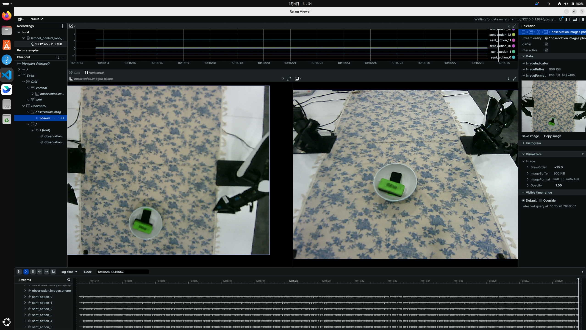
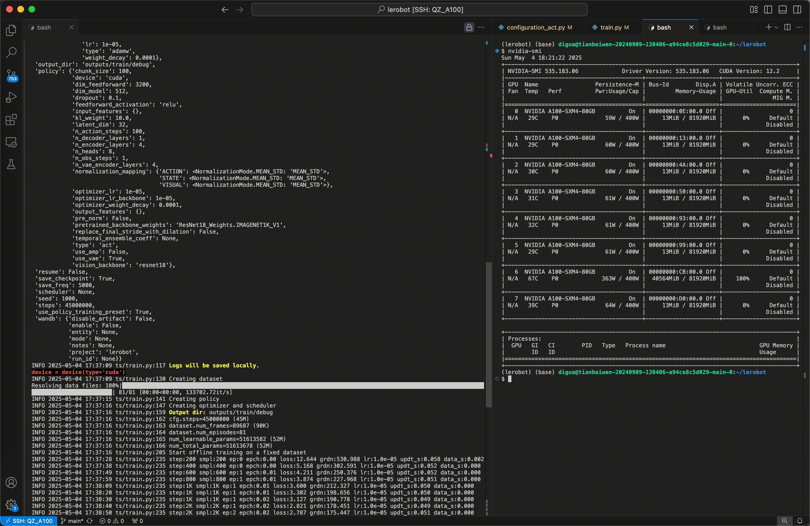
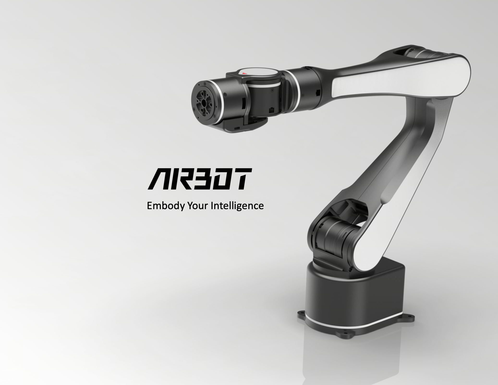
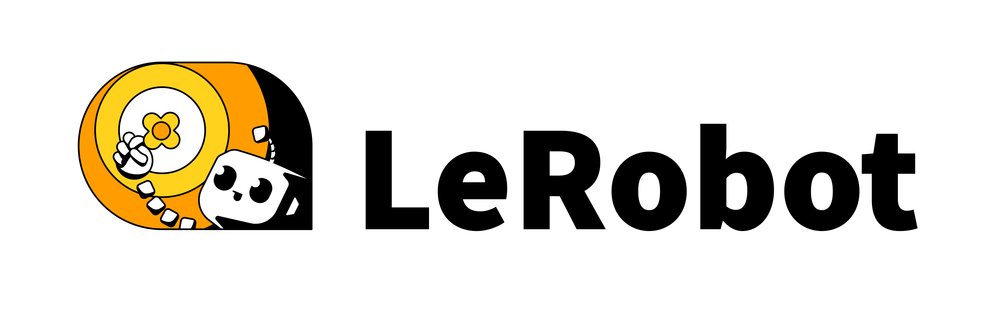
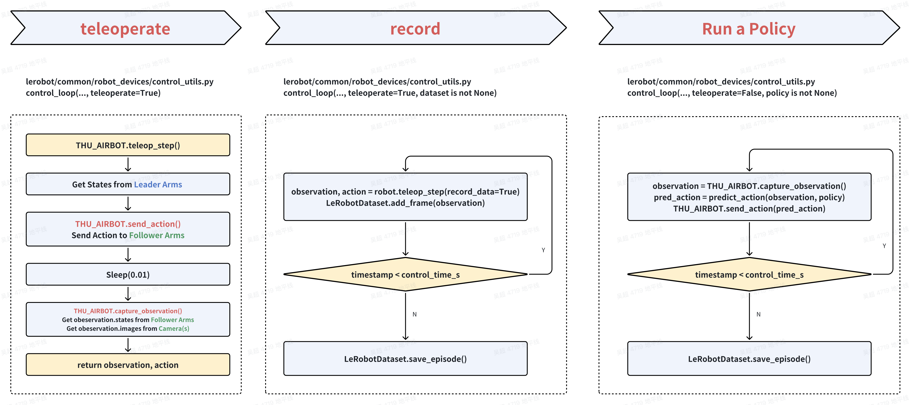

English | [简体中文](./README_cn.md)

# Using HuggingFace's LeRobot Framework with ThuAIRBOT on RDK Board

Adapting the ACT Policy end-to-end VQA algorithm from the LeRobot framework on the RDK device, and successfully applying it to a real-world clothing folding task has given us great confidence. We deeply appreciate how LeRobot simplifies the development of embodied intelligence.

This article takes the **ThuAIRBOT** robotic arm as an example to demonstrate in detail how to add a new robot to the LeRobot framework, connect it to the HuggingFace open-source ecosystem, and leverage LeRobot for teleoperation, data collection, saving datasets in standard LeRobot format, and rapidly reproducing various policy algorithms using the framework.




All source code files and README documentation are hosted at:

GitHub: [https://github.com/D-Robotics/RDK_LeRobot_Tools_4_THU_Discover_AirBotPlay](https://github.com/D-Robotics/RDK_LeRobot_Tools_4_THU_Discover_AirBotPlay)


**Previous References:**

GitHub: [https://github.com/D-Robotics/rdk_LeRobot_tools](https://github.com/D-Robotics/rdk_LeRobot_tools)  
NodeHub: [https://developer.d-robotics.cc/nodehubdetail/1918884279126081537](https://developer.d-robotics.cc/nodehubdetail/1918884279126081537)


## 1. Introduction to ThuAIRBOT



ThuAIR Robotics is driven by the vision of "bringing robots into every household." The company is committed to empowering industrial upgrades and promoting social progress through intelligent robotics technology. To accelerate the development and practical application of embodied intelligence, ThuAIR Robotics has developed the **AIRBOT series**, offering comprehensive solutions for embodied intelligence and robotics tailored for universities and research institutions.

**AIRBOT Product Website:** [https://airbots.online/zh](https://airbots.online/zh)  
**AIRBOT Product Resources:** [https://airbots.online/zh/dowload](https://airbots.online/zh/dowload)  
**AIRBOT Documentation:** [https://docs.airbots.online/zh/airbot-play/quick-start/overview/](https://docs.airbots.online/zh/airbot-play/quick-start/overview/)


## 2. Overview of HuggingFace LeRobot Framework



🤗 LeRobot aims to provide models, datasets, and tools for real-world robotics in PyTorch. The goal is to lower the barrier to entry to robotics so that everyone can contribute and benefit from sharing datasets and pretrained models.

🤗 LeRobot contains state-of-the-art approaches that have been shown to transfer to the real-world with a focus on imitation learning and reinforcement learning.

🤗 LeRobot already provides a set of pretrained models, datasets with human collected demonstrations, and simulation environments to get started without assembling a robot. In the coming weeks, the plan is to add more and more support for real-world robotics on the most affordable and capable robots out there.

🤗 LeRobot hosts pretrained models and datasets on this Hugging Face community page: huggingface.co/lerobot

GitHub: [https://github.com/huggingface/lerobot](https://github.com/huggingface/lerobot)  
HuggingFace: [https://huggingface.co/lerobot](https://huggingface.co/lerobot)


## 3. How to Add a New Robot to the HuggingFace LeRobot Framework?

### 3.1 Understanding How LeRobot Manages and Uses Different Robot Classes (Objects)

#### Robot Class

In the LeRobot project, the folder `lerobot/common/robot_devices/robots/` contains many predefined robot configurations. This directory holds the robot classes. Within various functionalities of LeRobot, these classes are instantiated using methods such as `make_robot` implemented in the `utils.py` module under `lerobot/common/robot_devices/robots/`.

```bash
lerobot/common/robot_devices/robots
├── configs.py
├── dynamixel_calibration.py
├── feetech_calibration.py
├── lekiwi_remote.py
├── manipulator.py
├── mobile_manipulator.py
├── stretch.py
├── thu-airbot.py
└── utils.py
```

#### Robot Configuration Class

The initialization configuration for each robot is stored in the file `lerobot/common/robot_devices/robots/configs.py`. This will be discussed in more detail later.

```bash
@RobotConfig.register_subclass("THU_AIRBOT")
@dataclass
class THU_AIRBOTConfig(ManipulatorRobotConfig):
    leader_arms: ...
    follower_arms: ...
    cameras: ...
```

### Flow Analysis


Teleoperation, data recording, and policy execution are all implemented via the script `lerobot/scripts/control_robot.py`.

- Use `--control.type=teleoperate` to run the `teleoperate()` function, calling `control_loop()` with `teleoperate=True` to enable teleoperation.
- Use `--control.type=record` to run the `record()` function, calling `control_loop()` with `teleoperate=True` and `dataset is not None` to perform data collection.
- Use `--control.type=run_policy` to run the `run_policy()` function, calling `control_loop()` with `teleoperate=False` and `policy is not None` to execute the policy.


### 3.2 Review Your Robot's SDK

ThuAIRBOT provides a Python API, which allows us to easily obtain the robotic arm's status and send control commands via the Python interface.

To control your own robot using the LeRobot framework, you need to identify the following APIs. Taking ThuAIRBOT as an example, here’s what needs to be reviewed:

#### (1) Connection

Import your robot’s package, which depends on the SDK used by your robot.

Based on your robot’s SDK, perform some basic settings — typically, the leader arm uses gravity compensation mode, and the follower arm uses planning/motion control mode.

```python
# Reference Code (AIRBOT Example)
from airbot_py.arm import AIRBOTPlay, RobotMode, SpeedProfile

# Leader
leader = AIRBOTPlay(url=cfg.ip, port=cfg.port)
leader.connect()
leader.switch_mode(RobotMode.GRAVITY_COMP)

# Follower
follower = AIRBOTPlay(url=cfg.ip, port=cfg.port)
follower.connect()
follower.switch_mode(RobotMode.PLANNING_POS)
follower.set_speed_profile(SpeedProfile.FAST)
```

#### (2) Get Arm Status

Use your robot's SDK to get the leader arm's status. Understand the return data type — usually a Python list, NumPy array, or similar structure. These can generally be converted into a PyTorch tensor (`torch.tensor`), which is required by LeRobot.

```python
# Reference Code (AIRBOT Example)

# Get observation.state
pos = leader.get_joint_pos()  # Returns: list[float]
eef = leader.get_eef_pos()    # Returns: list[float]

# Convert to torch.tensor
pos = np.array(pos + eef, dtype=np.float32)  # Returns: numpy.array
pos_tensor = torch.from_numpy(pos).float()   # Returns: torch.tensor
```

#### (3) Joint Limitation

Joint limits are usually provided in your robot's SDK documentation. For safety reasons, ThuAIRBOT provides minimum and maximum values for each degree of freedom. You should clamp the command before sending it to the follower arm.

```python
# Reference Code (AIRBOT Example)

# Get Max and Min limits
limit_max = [2.089, 0.181, 3.161, 3.012, 1.859, 3.017]
limit_min = [-3.151, -2.963, -0.094, -3.012, -1.859, -3.017]

# Clip
for i in range(6):
    pos[i] = pos[i] if pos[i] < self.limit_max[i] else self.limit_max[i]
    pos[i] = pos[i] if pos[i] > self.limit_min[i] else self.limit_min[i]
```

#### (4) Send Command to Robotic Arm

Use your robot’s SDK to send joint or end-effector positions.

```python
# Reference Code (AIRBOT Example)
follower.servo_joint_pos(pos)
follower.servo_eef_pos(eef_pos)
```

#### (5) Disconnect Safely

Use your robot’s SDK to safely disconnect the arm after operations.

```python
# Reference Code (AIRBOT Example)
leader.set_speed_profile(SpeedProfile.DEFAULT)
follower.set_speed_profile(SpeedProfile.DEFAULT)
```

### 3.3 Add a New Robot Configuration Class

To define a new robot configuration class, modify the file `lerobot/common/robot_devices/robots/configs.py`. Here, you write standard Python class definitions.

We added a `THU_AIRBOT_Play_SingleARM_Config` class for each arm to manage its IP and port number.

For camera parameters, we use the original LeRobot camera configuration, meaning all camera-related usage remains consistent with the original LeRobot implementation.


```python
class THU_AIRBOT_Play_SigleARM_Config:
    ip: str
    port: int
    def __init__(self, ip, port):
        self.ip = ip
        self.port = port

@RobotConfig.register_subclass("THU_AIRBOT")
@dataclass
class THU_AIRBOTConfig(ManipulatorRobotConfig):
    leader_arms: dict[str, MotorsBusConfig] = field(
        default_factory=lambda: {
            "left_leader": THU_AIRBOT_Play_SigleARM_Config(
                ip=airbot_ip,
                port=50053,
            ),
            "right_leader": THU_AIRBOT_Play_SigleARM_Config(
                ip=airbot_ip,
                port=50054,
            ),
        }
    )
    follower_arms: dict[str, MotorsBusConfig] = field(
        default_factory=lambda: {
            "left_follower": THU_AIRBOT_Play_SigleARM_Config(
                ip=airbot_ip,
                port=50051,
            ),
            "right_follower": THU_AIRBOT_Play_SigleARM_Config(
                ip=airbot_ip,
                port=50052,
            ),
        }
    )
    cameras: dict[str, CameraConfig] = field(
        default_factory=lambda: {
            "laptop": OpenCVCameraConfig(
                camera_index=0,
                fps=30,
                width=640,
                height=480,
            ),
            "phone": OpenCVCameraConfig(
                camera_index=2,
                fps=30,
                width=640,
                height=480,
            ),
        }
    )
    mock: bool = False
```

Here is the **English translation** of your content, with **Markdown formatting preserved exactly as requested**:


### 3.4 Adding a New Robot Class

Create a new file `lerobot/common/robot_devices/robots/thu_airbot.py` and implement the class for ThuAIRBOT. For convenience, you can also modify an existing robot class from the codebase.

To define your own robot class, you need to implement the following methods:

```bash
robot.__init__()
robot.connect() 
robot.disconnect()
robot.capture_observation()
robot.teleop_step()
robot.send_action()
```

#### (1) Implementation of `THU_AIRBOT.__init__()`

This method initializes your robot. You should focus on reading configuration items from the `config` object using nested indexing.

For camera initialization, we use LeRobot's built-in `make_cameras_from_configs()` function and pass in the `config` object.

```python
def __init__(self, config: THU_AIRBOTConfig):
    """
    Expected keys in config:
        - ip, port, video_port for the remote connection.
        - calibration_dir, leader_arms, follower_arms, max_relative_target, etc.
    """
    self.robot_type = config.type
    self.config = config
    self.is_connected = False
    # Your Robot
    self.leader_arms = {}
    for key, cfg in self.config.leader_arms.items():
        self.leader_arms[key] = AIRBOTPlay(url=cfg.ip,port=cfg.port)
    self.follower_arms = {}
    for key, cfg in self.config.follower_arms.items():
        self.follower_arms[key] = AIRBOTPlay(url=cfg.ip,port=cfg.port)
    # Origin LeRobot Cameras
    self.cameras = make_cameras_from_configs(self.config.cameras)
    ## pos limit
    self.limit_max = [2.089, 0.181, 3.161, 3.012, 1.859, 3.017]
    self.limit_min = [-3.151, -2.963, -0.094, -3.012, -1.859, -3.017]
```

#### (2) Implementation of `THU_AIRBOT.connect()`

Connect each component one by one. Note that for cameras, we enable asynchronous reading to reduce OpenCV frame read latency.

```python
def connect(self):
    # Leader
    for name in self.leader_arms:
        self.leader_arms[name].connect()
        self.leader_arms[name].switch_mode(RobotMode.GRAVITY_COMP)
    # Follower
    for name in self.follower_arms:
        self.follower_arms[name].connect()
        self.follower_arms[name].switch_mode(RobotMode.PLANNING_POS)
        self.follower_arms[name].set_speed_profile(SpeedProfile.FAST)
    # cameras
    for cam_name, cam in self.cameras.items():
        cam.connect()
        cam.async_read()
    
    self.safe_begin()
        
    self.is_connected = True
```

#### (3) Implementation of `THU_AIRBOT.disconnect()`

The `disconnect()` method is called by the class destructor. Add cleanup logic here to prevent abnormal robot behavior or potential hazards.

```python
def disconnect(self):
    if not self.is_connected:
        raise RobotDeviceNotConnectedError("Not connected.")
    # Leader
    for name in self.leader_arms:
        self.leader_arms[name].switch_mode(RobotMode.GRAVITY_COMP)
    # Follower 
    for name in self.follower_arms:
        self.follower_arms[name].switch_mode(RobotMode.GRAVITY_COMP)
    # cameras
    for cam_name, cam in self.cameras.items():
        cam.disconnect()
    self.is_connected = False
```

#### (4) Implementation of `THU_AIRBOT.capture_observation()`

Use your robot’s SDK to get data. For camera frames, just retrieve a reference to the image. If needed, you can use `copy.deepcopy()` to make a deep copy of the frame.

```python
def capture_observation(self) -> dict:
    if not self.is_connected:
        raise RobotDeviceNotConnectedError("Not connected. Run `connect()` first.")

    # Get observation.states from Follower Arms
    follower_arm_positions = []
    for name in self.follower_arms:
        pos = self.follower_arms[name].get_joint_pos()
        eef = self.follower_arms[name].get_eef_pos()
        pos = np.array(pos + eef, dtype=np.float32)
        pos_tensor = torch.from_numpy(pos).float()
        follower_arm_positions.extend(pos_tensor.tolist())
    follower_arm_positions = torch.tensor(follower_arm_positions, dtype=torch.float32)
    obs_dict = {"observation.state": follower_arm_positions}

    # Get observation.images from Camera(s)
    for cam_name, cam in self.cameras.items():
        frame = cam.color_image
        if frame is None:
            frame = np.zeros((cam.height, cam.width, cam.channels), dtype=np.uint8)
        obs_dict[f"observation.images.{cam_name}"] = torch.from_numpy(frame)

    return obs_dict
```

#### (5) Implementation of `THU_AIRBOT.teleop_step()`

This is the main teleoperation loop. The core logic involves reading joint positions from the leader arm and sending them to control the follower arm. Then, it captures joint positions from the follower arm as state data. Finally, it packages the data into a dictionary following LeRobot conventions and returns it.

```python
def teleop_step(self, record_data: bool = False) -> None | tuple[dict[str, torch.Tensor], dict[str, torch.Tensor]]:
    if not self.is_connected:
        raise RobotDeviceNotConnectedError("THU_AIRBOT is not connected. Run `connect()` first.")
    
    # Get States from Leader Arms 
    leader_arm_positions = []
    for name in self.leader_arms:
        pos = self.leader_arms[name].get_joint_pos()
        for i in range(6):
            pos[i] = pos[i] if pos[i] < self.limit_max[i] else self.limit_max[i]
            pos[i] = pos[i] if pos[i] > self.limit_min[i] else self.limit_min[i]
        eef = self.leader_arms[name].get_eef_pos()
        pos = np.array(pos + eef, dtype=np.float32)
        pos_tensor = torch.from_numpy(pos).float()
        leader_arm_positions.extend(pos_tensor.tolist())

    # Send Action to Follower Arms
    self.send_action(leader_arm_positions)
    time.sleep(0.01)

    # For Record
    if not record_data:
        return

    # Get observation.states from Follower Arms
    # Get observation.images from Camera(s)
    obs_dict = self.capture_observation()

    # Returns
    arm_state_tensor = torch.tensor(leader_arm_positions, dtype=torch.float32)
    action_dict = {"action": arm_state_tensor}

    return obs_dict, action_dict
```

#### (6) Implementation of `THU_AIRBOT.send_action()`

Use your robot’s SDK to send actions. You may also include logic for limiting joint values here.

```python
def send_action(self, action: torch.Tensor) -> torch.Tensor:
    if not self.is_connected:
        raise RobotDeviceNotConnectedError("Not connected. Run `connect()` first.")

    slice_begin = 0
    slice_end = 7
    for follower in self.follower_arms:
        self.follower_arms[follower].servo_joint_pos(action[slice_begin:slice_end-1])
        self.follower_arms[follower].servo_eef_pos(action[slice_end-1:slice_end])
        slice_begin += 7
        slice_end += 7

    return action
```


### 3.5 Import Your Robot Configuration

You can duplicate `lerobot/scripts/control_robot.py`, for example as `control_my_robot.py`, and replace the line `robot = make_robot_from_config(cfg.robot)` with direct instantiation of your robot class.

```python
def control_robot(cfg: ControlPipelineConfig):
    init_logging()
    logging.info(pformat(asdict(cfg)))
    # robot = make_robot_from_config(cfg.robot)
    from lerobot.common.robot_devices.robots.thu_airbot import THU_AIRBOT
    robot = THU_AIRBOT(cfg.robot)
    ...
```


## 4. Teleoperate Using Your Custom Robot Class

```bash
python lerobot/scripts/control_my_robot.py \
  --robot.type=THU_AIRBOT \
  --robot.cameras='{}' \
  --control.type=teleoperate
```


## 5. Record Data Using Your Custom Robot Class

In addition to calling your own script, all other parameters remain consistent with the original LeRobot. This means you can perform visualized data recording and visualize the generated dataset using LeRobot tools.

```bash
python lerobot/scripts/control_my_robot_thu.py  \
 --robot.type=THU_AIRBOT   \
 --control.type=record   \
 --control.fps=30   \
 --control.single_task="Fold shirt."  \
 --control.warmup_time_s=10   \
 --control.episode_time_s=150   \
 --control.reset_time_s=50000   \
 --control.num_episodes=100   \
 --control.push_to_hub=false   \
 --control.display_data=true   \
 --control.repo_id=USER/so100_test \
 --control.root=datasets/debug_test \
 --control.resume=false
```

Visualization result reference:


## 6. Validate Policy Algorithms on Real Hardware Using Your Custom Robot Class

Use the `record` mode to run policy inference and record evaluation datasets simultaneously.

```bash
python lerobot/scripts/control_my_robot.py \
  --robot.type=so100 \
  --control.type=record \
  --control.fps=30 \
  --control.single_task="Cloth Fold" \
  --control.repo_id=USER/eval_act_so100_0418_test1 \ 
  --control.tags='["tutorial"]' \
  --control.warmup_time_s=5 \
  --control.episode_time_s=180 \
  --control.reset_time_s=30 \
  --control.num_episodes=10 \
  --control.push_to_hub=false \
  --control.policy.path=outputs/act_so100_resnet152_0418_test1/pretrained_model
```


